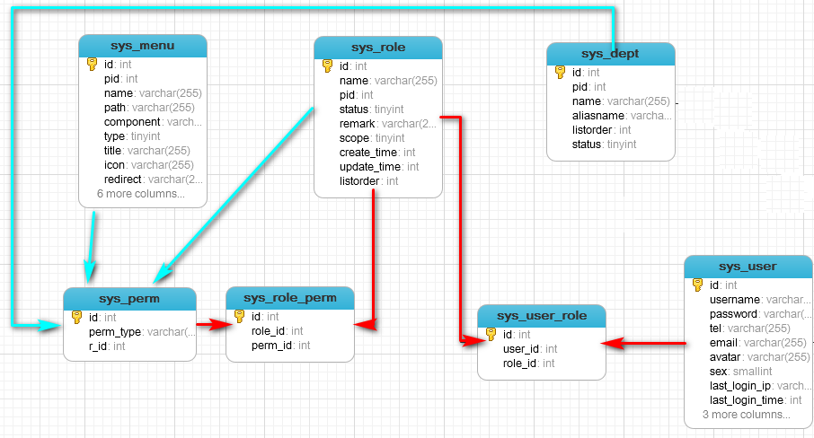

# [vue3-admin-php-demo](http://pocoyo.rr.nu:10000)

# vue-php-admin 项目说明
通用后台角色权限管理系统, 基于 [v3-admin-vite](https://github.com/un-pany/v3-admin-vite) 和 [PHP CodeIgniter 4.5.0](https://github.com/codeigniter4/framework) RESTful 实现，采用前后端分离架构的权限管理系统，PHP快速开发平台，目标是搭建一套简洁易用的快速解决方案，可以帮助用户有效降低项目开发难度和成本。

以 [v3-admin-vite](https://github.com/un-pany/v3-admin-vite) 前端模板为基础，修改动态路由部分，实现菜单路由可根据后端角色进行动态加载。
后端路由权限基于 php-jwt 使用 PHP CI4 AuthFilter 做token及权限认证。

V3 Admin Vite 基于 Vue3、TypeScript、Element Plus、Pinia 和 Vite 等主流技术。

## 主要功能
- [x] 1. 系统登录：系统用户登录，`jwt token方式`
- [x] 2. 用户管理：新建用户，修改用户，删除用户，查询用户
- [x] 3. 角色管理：新建角色，修改角色，删除角色，查询角色
- [ ] 4. 菜单管理：新建菜单，修改菜单，删除菜单，查询菜单
- [ ] 5. 部门管理：新建部门，修改部门，删除部门，查询部门
- [x] 6. **jwt生成访问与刷新token， access_token过期后，根据refreshtoken刷新访问token，实现无缝刷新功能。refreshtoken 加入计数器,在有效期内接口调用超过一定次数自动续期** 
- [ ] 7. 图形验证码（`gregwar/captcha` 包生成）
- [ ] 8. 系统日志

## 使用说明
### 目录结构
v3-admin-vite/ 前端模板

CodeIgniter4/ 后端 Restful API 接口

### 前端

  1. 一键安装 .vscode 目录中推荐的插件
  2. node 版本 18.x 或 20+
  3. pnpm 版本 8.x 或最新版

	进入项目目录

	```
	cd v3-admin-vite
	```

  安装依赖

	```
	pnpm i
	```

   启动服务

	```
	pnpm dev
	```

### 后端
   **php 8.1+**

	```php
    cd CodeIgniter4

    composer install  // 根据composer.json 初始安装所有插件包

    cp env .env
    # 根据实际修改 app.baseURL , postman测试 http://{app.baseURL} API配置正确
	```

### 生产环境部署

## 角色权限说明
1. 这里将权限抽象成三种权限（可扩展更多），菜单类权限（包括控件按钮），角色类权限（用户可分配的角色），部门数据类权限（用户可查看的部门数据），参考 [角色权限组+资源分配](https://blog.csdn.net/qiuziqiqi/article/details/65437123)
2. 前端添加菜单，角色，部门的时候，后端生成对应的权限，写入 `sys_perm` 表，系统的超级管理员角色自动拥有了所有权限（也可根据具体业务需要进行设计）
3. 用户->角色->权限
4. 数据权限： 实际开发中，需要设置用户只能查看哪些部门的数据，这种情况一般称为数据权限。数据权限需要在对应的业务类型表里加入部门数据字段来进行sql条件限制
   在（系统管理-角色管理）设置需要数据权限的角色, 添加了角色授权范围 
   全部数据权限/部门数据权限/部门及以下数据权限/仅本人数据权限/自定数据权限
   业务代码逻辑可先根据授权范围，来处理来判断角色拥有的部门数据权限，全部数据权限则sql语句不做限制，
   部门数据及以下数据权限，及本人数据需要对sql语句做限制，自定义数据权限，则sql语句加入自定义的部门限制条件即可

 

## 数据库表说明

| Tables_in_vueadminv2 | 说明                                      |
|---------------------:|----------------------------------------- |
| keys                 | 未用       |
| logs                 | 未用       |
| sys_dept             | 系统部门表                                 |
| sys_menu             | 系统菜单表                                 |
| sys_perm             | 系统权限表                                 |
| sys_perm_type        | 权限类型（暂时未用到）                       |
| sys_role             | 系统角色表                                 |
| sys_role_perm        | 角色权限关系表                              |
| sys_user             | 系统用户表                                 |
| sys_user_dept        | 用户所属部门表（可一对多）                    |
| sys_user_role        | 用户角色对应关系                            |
| sys_user_token       | 使用JWT token此表无用                       |
| upload_tbl           | 业务测试表                                  |

## RESTful
 - 使用 catfan/medoo 实现 **复杂分页过滤排序**
    
    前端GET请求参数与使用的 table 组件有关

    ```
    GET /articles?offset=1&limit=30&sort=-id&fields=id,title,author&query=~author,title&author=888&title=world

    limit:  每页记录数，后台会配置默认值
    offset: 第几页，后台会配置默认值
    sort:   支持多个参数 &sort=-id,+author => id降序 author 升序
    fileds: 指定要获取的显示字段 => 降低网络流量
    query:  支持多个参数 &query=~author,title => author like 模糊查询， title精确查询 &author=888&title=world 需要配合query参数才有意义
    ```


## 前端目录树
## 多级菜单配置

## 特性
  - Vue3：采用 Vue3 + script setup 最新的 Vue3 组合式 API
  - Element Plus：Element UI 的 Vue3 版本
  - Pinia: 传说中的 Vuex5
  - Vite：真的很快
  - Vue Router：路由路由
  - TypeScript：JavaScript 语言的超集
  - PNPM：更快速的，节省磁盘空间的包管理工具
 

